# reiss-mcpherson-effects

Audio plugins from Reiss & McPherson's *Audio Effects: Theory,
Implementation and Application*, ported from
[Juan Gil's JUCE implementations](https://github.com/juandagilc/Audio-Effects)
to the [truce](https://github.com/truce-audio/truce) framework.

Each plugin builds as CLAP / VST3 / LV2 / AU / AAX / Standalone.

## Plugins

Screenshots below are rendered with `cargo truce screenshot` at
the default 2× scale, so every PNG is captured at the same
fixed DPI; the `width` / `height` on each `` are the
plugin's logical-point dimensions, which keeps the rendered
density identical regardless of widget count.

| Crate                                      | Effect                                | Screenshot |
| ------------------------------------------ | ------------------------------------- | ---------- |
| `reiss-mcpherson-delay`                    | Circular-buffer delay                 | 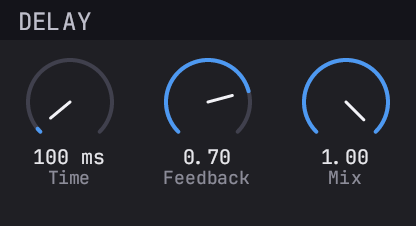 |
| `reiss-mcpherson-vibrato`                  | LFO-modulated delay (pitch wobble)    | 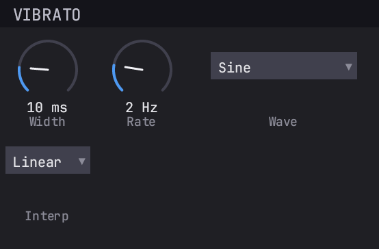 |
| `reiss-mcpherson-flanger`                  | Modulated short delay + dry sum       | 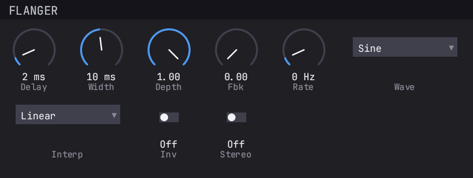 |
| `reiss-mcpherson-chorus`                   | Multi-voice ensemble chorus           | 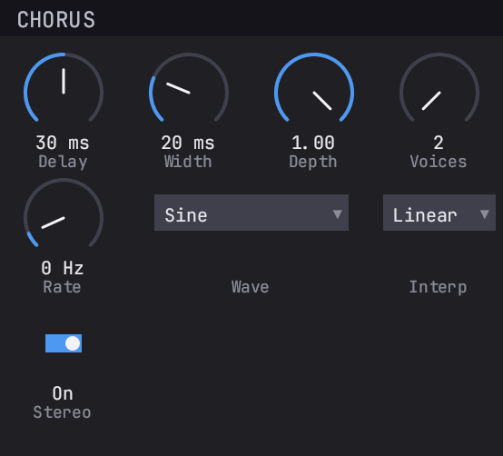 |
| `reiss-mcpherson-pingpong`                 | Cross-channel ping-pong delay         | 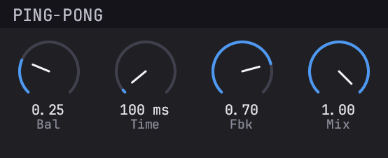 |
| `reiss-mcpherson-parametric-eq`            | Single-band parametric EQ (7 shapes)  | 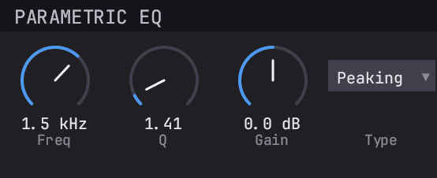 |
| `reiss-mcpherson-wahwah`                   | Manual / LFO / envelope wah           | 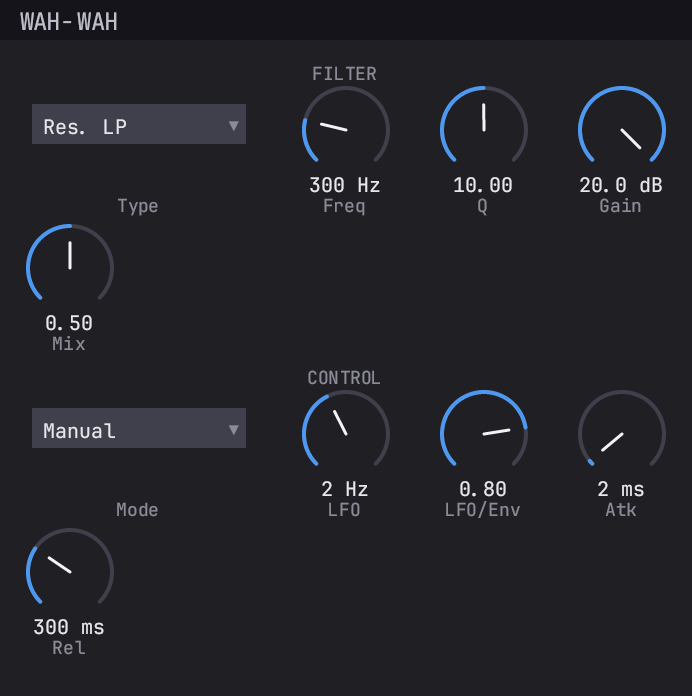 |
| `reiss-mcpherson-phaser`                   | Cascaded all-pass phaser              | 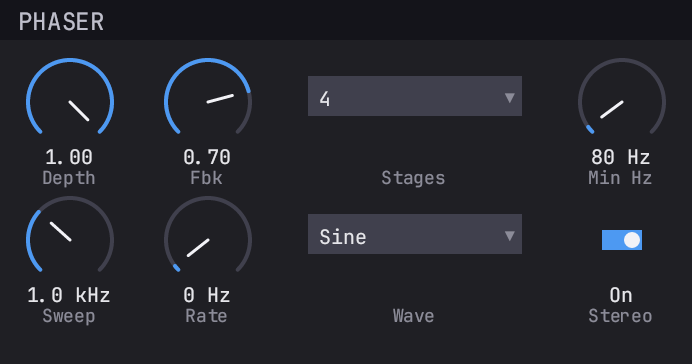 |
| `reiss-mcpherson-tremolo`                  | LFO amplitude modulation              | 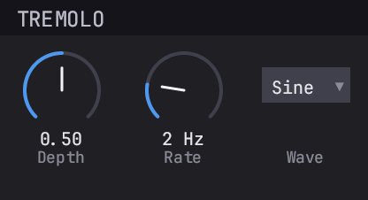 |
| `reiss-mcpherson-ringmod`                  | Ring modulation                       | 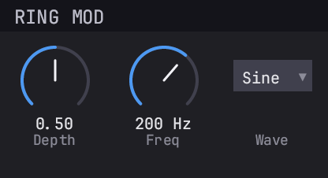 |
| `reiss-mcpherson-compressor`               | Compressor / expander / gate          | 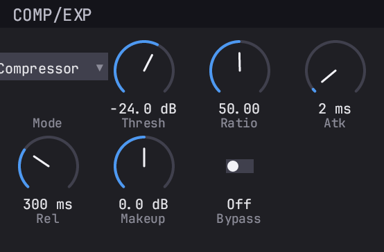 |
| `reiss-mcpherson-distortion`               | 5-shape waveshaper + tone shelf       | 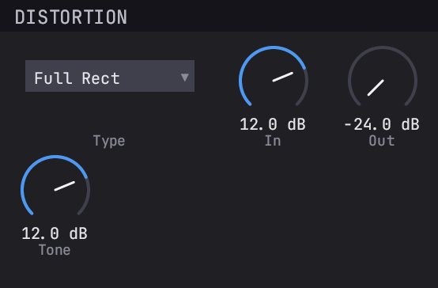 |
| `reiss-mcpherson-panning`                  | Panorama+precedence / ITD+ILD pan     | 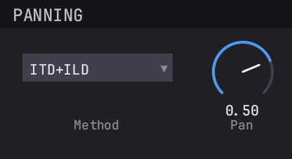 |
| `reiss-mcpherson-robotization`             | Phase-vocoder robot / whisper         | 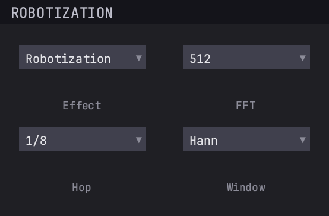 |
| `reiss-mcpherson-pitchshift`               | Phase-vocoder pitch shifter           | 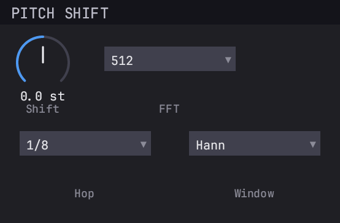 |

## Build

See the [truce repo](https://github.com/truce-audio/truce) for
build, install and packaging instructions.

## Licensing

Dual-licensed under Apache-2.0 OR MIT, at your option.
